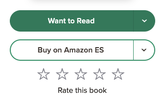

# Goodreads Crawler & Ranker

Async crawler and ML recommendation pipeline to find good books to read.

## Setup 
1. **Save Books to Your Goodreads Library:**

    

    Your library seeds the crawler.<br>
    Books marked as 'Read' train your personal model.

2. **Install Requirements:**
    ```bash
    pip install -r requirements.txt
    playwright install chromium
    nbstripout --install
    nbdime config-git --enable
    ```

3. **Configure Credentials:**
    
    Create a `.env` file in the root with:
    ```ini
    GOODREADS_EMAIL=your_email@example.com
    GOODREADS_PASSWORD=your_password
    ```

4. **Set up Ollama** *(If you want to train a personal model)*:

    a. Download and install [Ollama](https://ollama.com/download)
    ```bash
    brew install ollama
    ```
    b. Pull an embedding model. I'm using [qwen3 0.6b](https://ollama.com/library/qwen3-embedding:0.6b):
    ```bash
    ollama pull qwen3-embedding:0.6b
    ```
    c. Run Ollama to serve inference:
    ```bash
    ollama serve
    ```


## Usage
1. **Crawl Goodreads:**
    ```bash
    python3 crawler.py
    ```
    *Optional Flag*: `--fd` prompts a fresh download of your Goodreads library.

2. **Train & Get Recommendations**
    ```bash
    python3 recommend.py
    ```
    Outputs a ranked list of books for you to choose from.